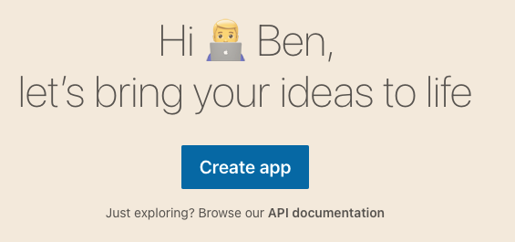
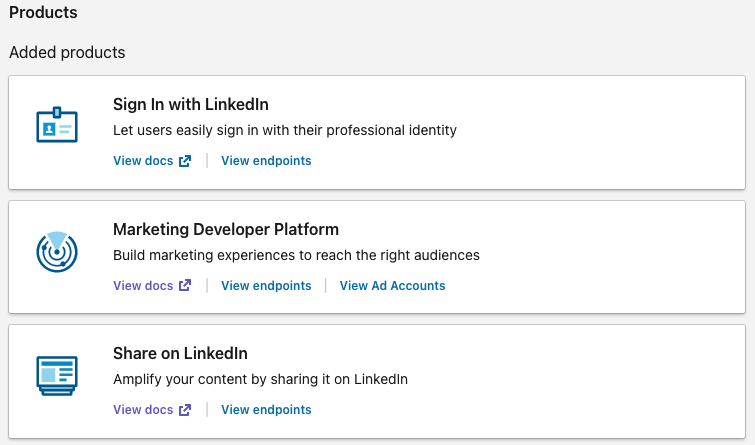

# Instructions for First Time Set Up

These instructions will walk you through authenticating to LinkedIn, and receiving your LinkedIn code, which is needed to use this integration. You will only need to do this one time.

## Creating a LinkedIn Developers App

The first thing you must do is create a LinkedIn Developers app.

Navigate to the [LinkedIn Developers](https://www.linkedin.com/developers/) website and click the "Create App" button.

This will direct you to a short form where LinkedIn will ask you for a few pieces of information:

* **App name**: Feel free to put anything you would like, perhaps `orbit-workspace-integration`
* **LinkedIn page**: Enter the LinkedIn page web address this integration is for. An admin *must* verify the app.
* **App logo**: Upload an image representing your company or organization
* **Legal agreement**: Click the checkbox to agree to the terms

Once you submit the form, it usually takes 3-4 days for LinkedIn to confirm the application and grant it credentials. During that time, an admin of the LinkedIn company or organization page, needs to verify the application's request for access by going to the LinkedIn page admin dashboard and doing so.

While you wait for verification, you can do the next step, which is to request the right API scope from LinkedIn.

## Requesting the LinkedIn Marketing Developer Platform API Access

LinkedIn has many different types of APIs and many different types of access levels to those APIs. The API your app needs access to is the **Marketing Developer Platform**.

From within your LinkedIn Developers dashboard, navigate to the "Products" page and submit the access request form.

This will take another few days for LinkedIn to verify and confirm this request. Once it is done, you will see the Marketing Developer Platform in your list of "Added Products" like shown in the next screenshot.

## LinkedIn API Credentials

You will need your LinkedIn API credentials to move forward. You can copy your LinkedIn credentials, which are your Client ID and Client Secret from the "Auth" section in the LinkedIn Developers dashboard.

Make sure to save those somewhere safe and where you can access them as we will need them again shortly.

You will also see on the "Auth" page a section called "OAuth 2.0 Settings". We will return here later in order to enter a URL in the "Authorized redirect URLs for your app" section.

After you have finished all of the above steps, you are ready to move on to the last step in this first time setup instructions.

## LinkedIn Browser Code

LinkedIn uses OAuth 2.0 as its authentication format, and as such, you need to authenticate *one-time* with your browser to obtain a code that will be used for the integration from then on. 

The `linkedin_orbit` integration includes an authentication application to facilitate this process for you. It requires that you have a [Heroku](https://www.heroku.com/) account. It is free to set up a Heroku account, and the one-time authentication app, is fine to run inside the free tier of the platform.

Click on the following button to begin deploying the authentication app to Heroku:

You will need to supply your LinkedIn Client ID and LinkedIn Client Secret as part of the deployment process. These are not stored by Orbit or inside this repository. They are only stored by Heroku as part of your Heroku account.

