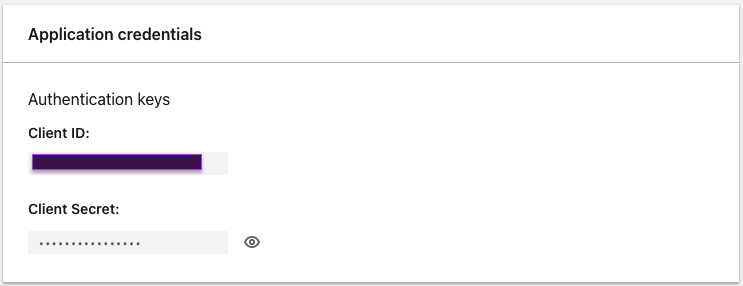
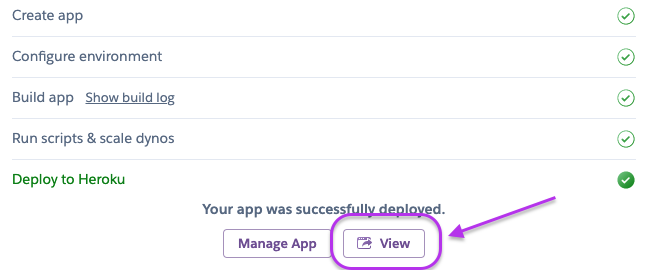

# Instructions for First Time Set Up

These instructions will walk you through authenticating to LinkedIn, and receiving your LinkedIn token, which is needed to use this integration. You will only need to do this once every two months.

## Creating a LinkedIn Developers App

The first thing you must do is create a LinkedIn Developers app.

Navigate to the [LinkedIn Developers](https://www.linkedin.com/developers/) website and click the "Create App" button.

This will direct you to a short form where LinkedIn will ask you for a few pieces of information:

* **App name**: Feel free to put anything you would like, perhaps `orbit-workspace-integration`
* **LinkedIn page**: Enter the LinkedIn page web address this integration is for. An admin *must* verify the app.
* **App logo**: Upload an image representing your company or organization
* **Legal agreement**: Click the checkbox to agree to the terms

Once you submit the form, it usually takes 3-4 days for LinkedIn to confirm the application and grant it credentials. During that time, an admin of the LinkedIn company or organization page, needs to verify the application's request for access by going to the LinkedIn page admin dashboard and doing so.

While you wait for verification, you can do the next step, which is to request the right API scope from LinkedIn.

## Requesting the LinkedIn Marketing Developer Platform API Access

LinkedIn has many different types of APIs and many different types of access levels to those APIs. The API your app needs access to is the **Marketing Developer Platform**.

From within your LinkedIn Developers dashboard, navigate to the "Products" page and submit the access request form.

This will take another few days for LinkedIn to verify and confirm this request. Once it is done, you will see the Marketing Developer Platform in your list of "Added Products" like shown in the next screenshot.

## LinkedIn API Credentials

You will need your LinkedIn API credentials to move forward. You can copy your LinkedIn credentials, which are your Client ID and Client Secret from the "Auth" section in the LinkedIn Developers dashboard.

Make sure to save those somewhere safe and where you can access them as we will need them again shortly.

You will also see on the "Auth" page a section called "OAuth 2.0 Settings". We will return here later in order to enter a URL in the "Authorized redirect URLs for your app" section.

After you have finished all of the above steps, you are ready to move on to the last step in this first time setup instructions.

## LinkedIn Token

**Do not proceed to this step until you have received approval from LinkedIn for your API access request. This next step will not work until that has happened.**

LinkedIn uses OAuth 2.0 as its authentication format, and as such, you need to authenticate *one time every two months* to obtain a token that will be used for the integration from then on. 

The `linkedin_orbit` integration includes an authentication application to facilitate this process for you. It requires that you have a [Heroku](https://www.heroku.com/) account. It is free to set up a Heroku account, and the one-time authentication app, is fine to run inside the free tier of the platform.

Click on the _Deploy to Heroku_ button below to begin deploying the authentication app to Heroku:

You will need to supply your LinkedIn Client ID and LinkedIn Client Secret as part of the deployment process. These are not stored by Orbit or inside this repository. They are only stored by Heroku as part of your Heroku account.

Once the app has been deployed on Heroku, click on the "View" button as shown below.

This will load a new browser window with the app rendered.

Copy the URL of the Heroku app in your browser address bar and return to the LinkedIn Developers dashboard. In the LinkedIn Developers dashboard click on "Auth" from the navigation menu" and then click on the pencil icon in the "Authorized redirect URLs for your app" section of the page, as shown below.

You will see a link appear called "+ Add redirect URL". Click on that link. In the text box that appears above it enter your Heroku app URL with "/auth/linkedin/callback" appended at the end. For example, if your Heroku URL was "https://example-heroku-app-url.herokuapp.com" then the full address you need to enter would be: "https://example-heroku-app-url.herokuapp.com/auth/linkedin/callback". When you are finished, click on the "Update" button.

Now, return back to your browser window with your Heroku app running. Click on the "LinkedIn" link on the app. Follow the prompts by LinkedIn to authorize your LinkedIn Developer application. When you are finished, you will be redirected back to your Heroku app and you will see a LinkedIn token. This token is very important. The token you see will be the credential used to authenticate to LinkedIn.

The last step you need to complete in this first time setup is to add the LinkedIn token you created into the LinkedIn Orbit community integration credentials, either in the context of a standalone app or in the context of running it as a GitHub Action.

## Add the LinkedIn Token to the LinkedIn Orbit Community Integration
### Within GitHub Actions

*(This step assumes you have a GitHub repository created already to run the LinkedIn Orbit community integration. If you do not, please follow [this guide](https://docs.github.com/en/github/getting-started-with-github/create-a-repo) first.)*

The LinkedIn token you created in the last step needs to be added to the GitHub repository that you are running the LinkedIn Orbit community integration from. To do so, follow the step-by-step guide in the [README](https://github.com/orbit-love/github-actions-templates/blob/main/README.md#adding-your-credentials-to-github) in the GitHub Actions instructions. The name for this secret **must** be: `LINKEDIN_TOKEN`.

### Within a Standalone App

If you are running the community integration as a standalone app, you can add the LinkedIn token as an environment variable inside the `.env` file in the root directory of the codebase.

Open up the `.env` file and add a new line starting with `LINKEDIN_TOKEN=` and add the LinkedIn Code after the equal sign.
## Wrapping Up

You have now successfully finished the setup for your LinkedIn Orbit community integration. This steps needs to occur once every 60 days.

In between, you can safely delete the Heroku app you created and recreate a new one when you need to do this again.

From within the Heroku dashboard, navigate to the "Settings" for the app and at the very bottom of the page is a button called "Delete app". Once you click on that button, Heroku will confirm you wish to delete the app. Upon confirmation, the app will be deleted and the deployment on the web will be removed.
